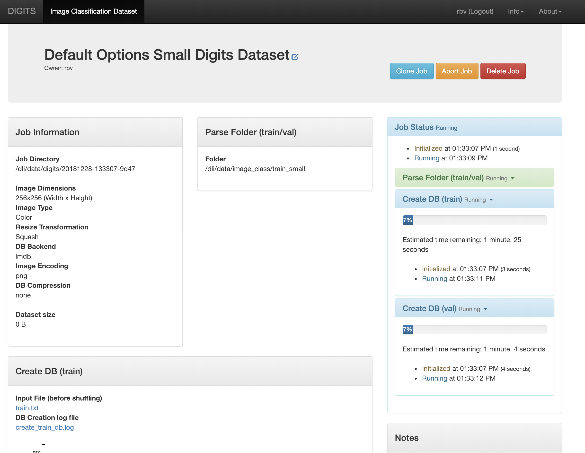
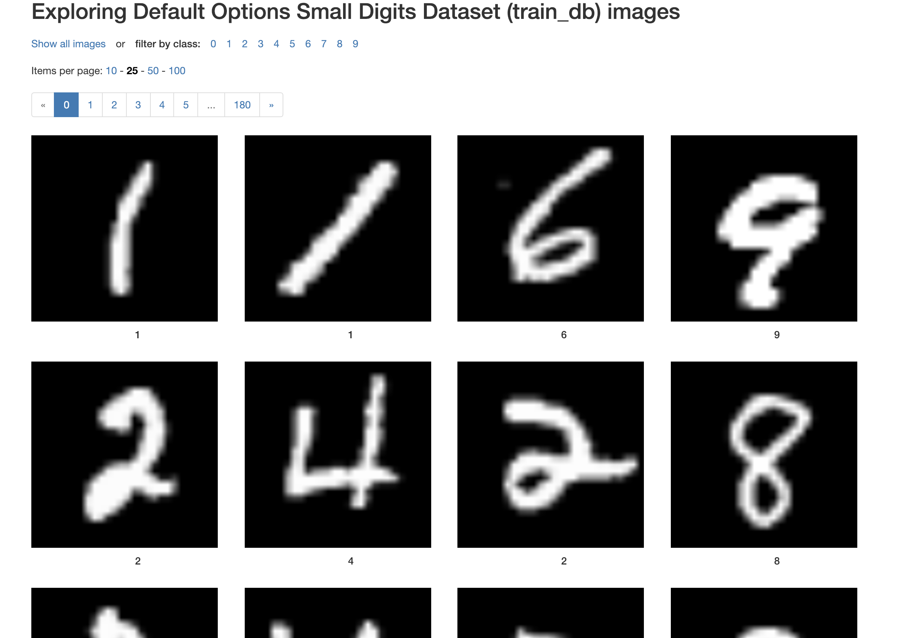
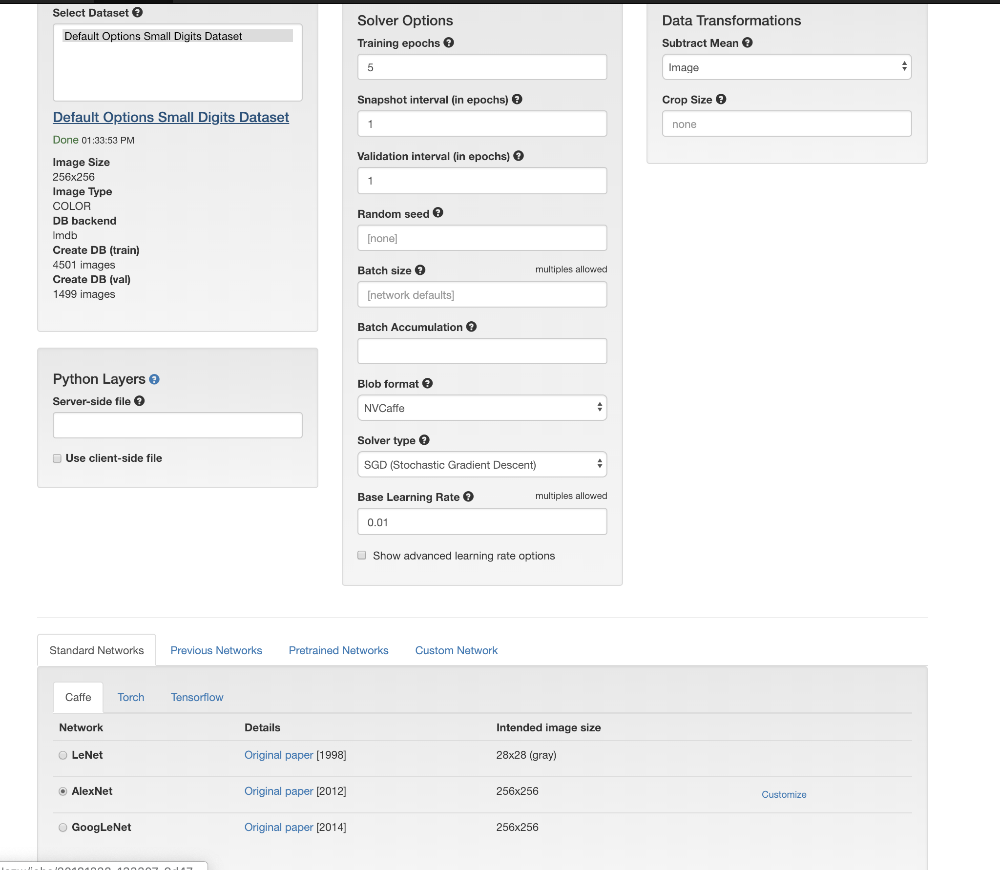
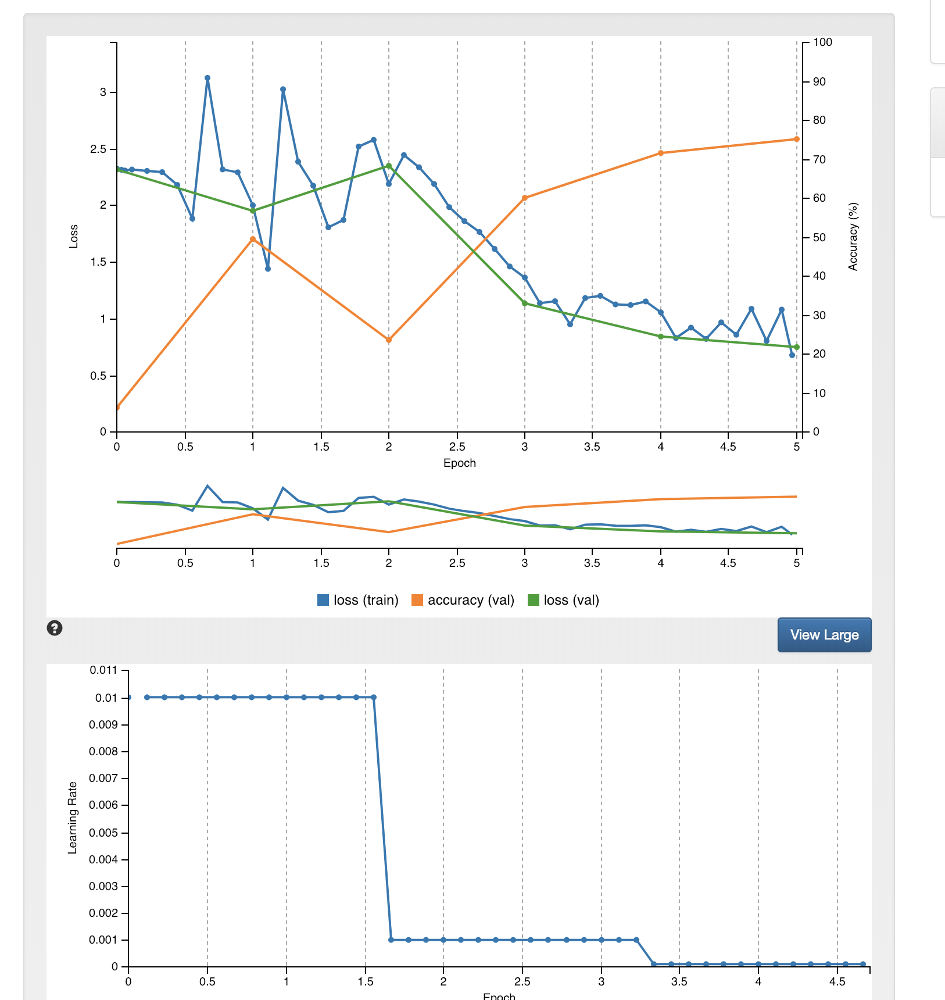
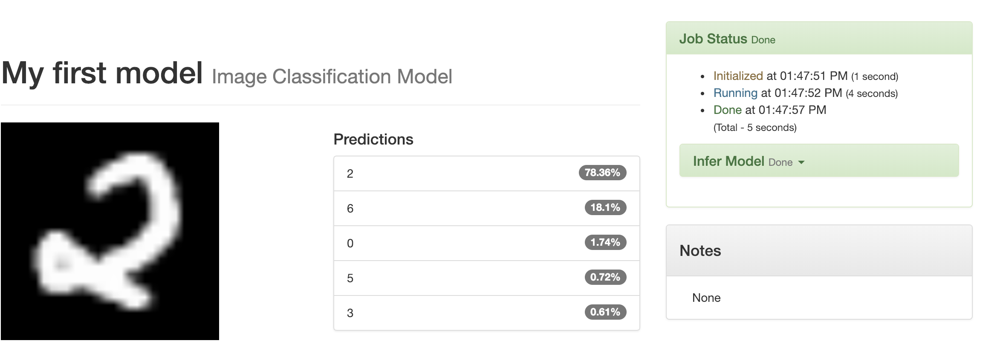
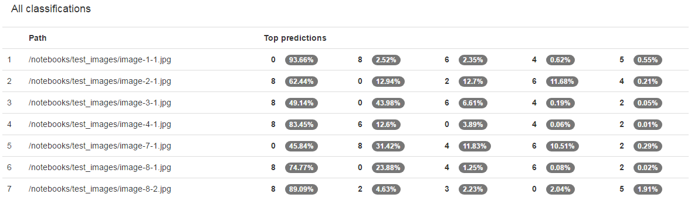
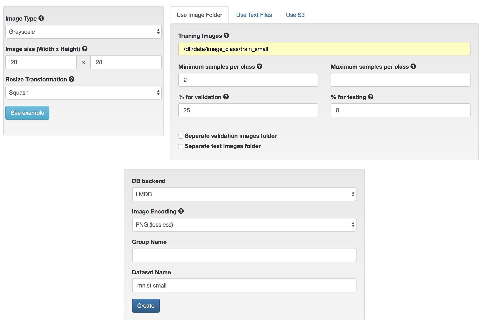
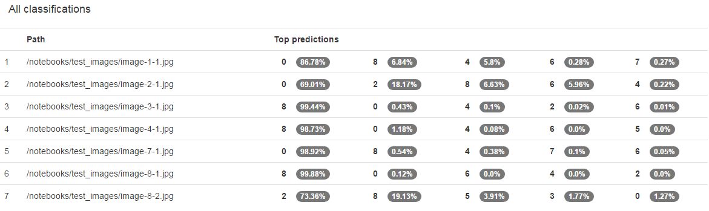
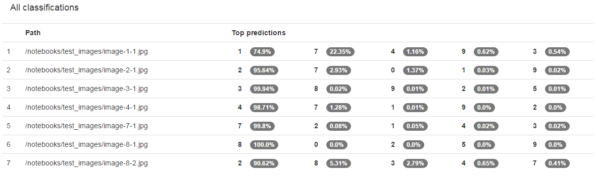

# Image Classification with DIGITS

#### Loading our first dataset:

#### Explore the db:

#### Create model:

#### Verification:

#### Improving your Model

Test a list of images

#### The right model

###### Result test a list of images

###### Training Images - image_class/train_invert

# Summary

In this lab you were introduced to Deep Learning and all of the steps necessary to classify images including data processing, training, testing, and improving your network through data augmentation and network modifications. In the training phase, you learned about the parameters that can determine the performance of training a network. By training a subset of the MNIST data, a full set, different models, augemented data, etc. you saw the types of options you have to control performance. In testing our model, we found that although the test images were quite different than the training data, we could still correctly classify them.
