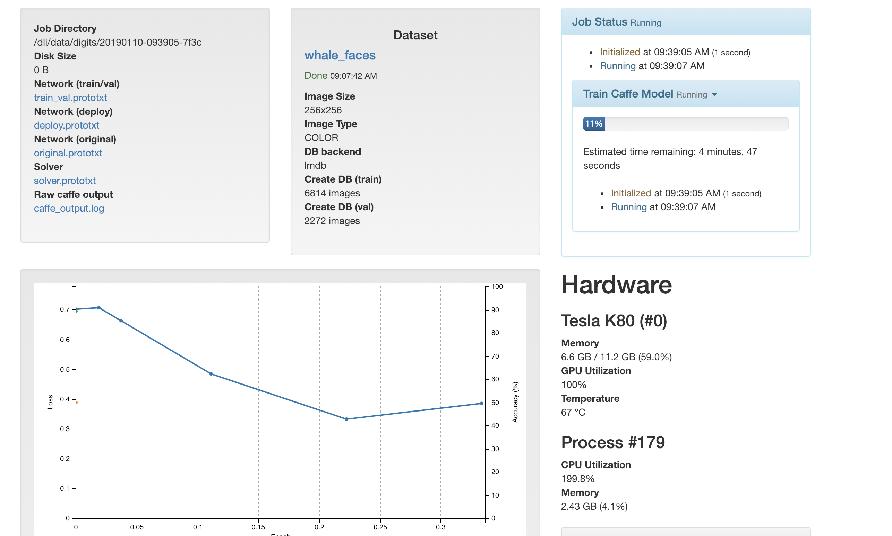

# Image Classification with DIGITS

#### Getting your model from DIGITS:

#### Using our learned function: Forward Propagation¶:

#### Next, let's implement some code around our function to iterate over the image and classify each grid_square to create a heatmap. Note that the key lesson of this section is that we could have built ANYTHING around this function, limited only by your creativity.:

#### The code block below just groups everything we did into one block. You can run it as many times as you want to run multiple aerial images through your new object detection tool.:

#### Rebuilding from an existing neural network

Test a list of images

